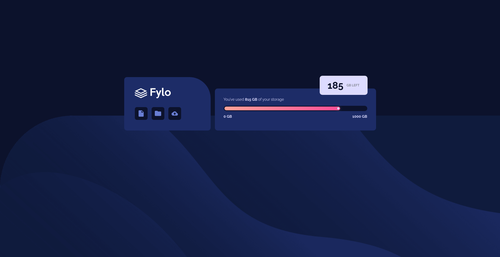
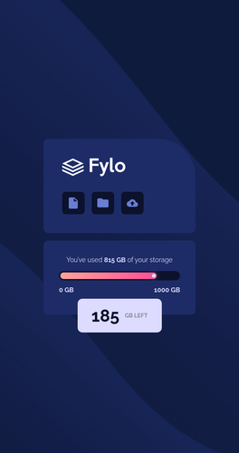

# Frontend Mentor - Fylo data storage component solution

This is a solution to the [Fylo data storage component challenge on Frontend Mentor](https://www.frontendmentor.io/challenges/fylo-data-storage-component-1dZPRbV5n). Frontend Mentor challenges help you improve your coding skills by building realistic projects. 

## Table of contents

- [Overview](#overview)
  - [The challenge](#the-challenge)
  - [Screenshot](#screenshot)
  - [Links](#links)
- [My process](#my-process)
  - [Built with](#built-with)
  - [What I learned](#what-i-learned)
  - [Continued development](#continued-development)
  - [Useful resources](#useful-resources)
- [Author](#author)

**Note: Delete this note and update the table of contents based on what sections you keep.**

## Overview

### The challenge

Users should be able to:

- View the optimal layout for the site depending on their device's screen size

### Screenshot




### Links

- Solution URL: [Add solution URL here](https://your-solution-url.com)
- Live Site URL: [https://loganwoolf.github.io/FM-storage-component/](https://loganwoolf.github.io/FM-storage-component/)

## My process

### Built with

- Semantic HTML5 markup
- CSS custom properties
- Flexbox and Grid
- Mobile-first workflow

### What I learned

Here are some highlights from the code.
1. How to get the logo the correct size:
```css
#id { 
  height: 40px; /*size the logo down to 40px tall*/
  object-fit: scale-down; /*size width to match aspect ratio of image*/
}
```
2. How to make icons the same size with different graphic sizes:
```css
.operations {
  display: grid;
  grid-template-columns: repeat(3, 48px); /*size of grid cell*/
  grid-auto-rows: 48px;
  align-items: center;
  gap: 15px;
}
.op-icon {
  background-color: var(--color4);
  border-radius: 8px;
  height: 100%; /*make icons full height of grid cell*/
  display: flex;
  justify-content: center;
}
.op-icon > img {
  object-fit: none; /*keeps images at original size*/
}
```
3. How to build a meter, see code.

4. Absolute positioning to pull items out of the flow.

5. How to make a nice triangle for the bubble:
```css
.triangle {
    position: absolute;
    width: 40px;
    height: 40px;
    background-color: var(--color1);
    clip-path: polygon(100% 0%, 00% 100%, 100% 100%);
    transform: rotate(-90deg);
    right: 32px;
    top: 5px;
  }
```

### Useful resources

- [How to Undo Almost Anything with Git](https://github.blog/2015-06-08-how-to-undo-almost-anything-with-git/#reset-local-changes) - Specifically,
```
$ git log
$ git reset --hard <last good SHA>
```
- [CSS3 Progress Bars](https://css-tricks.com/css3-progress-bars/) - Good progress bar introduction which was recently updated.

## Author

- Website - [Logan Woolf](https://loganwoolf.github.io/)
- Frontend Mentor - [@loganwoolf](https://www.frontendmentor.io/profile/loganwoolf)
- Twitter - [@logan__woolf](https://www.twitter.com/logan__woolf)
